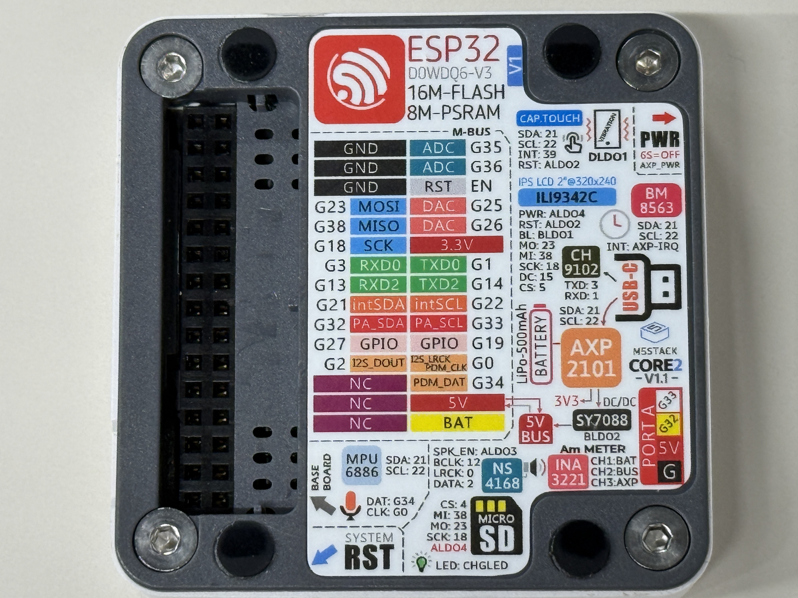
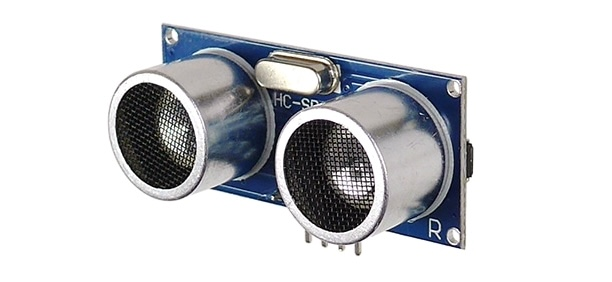
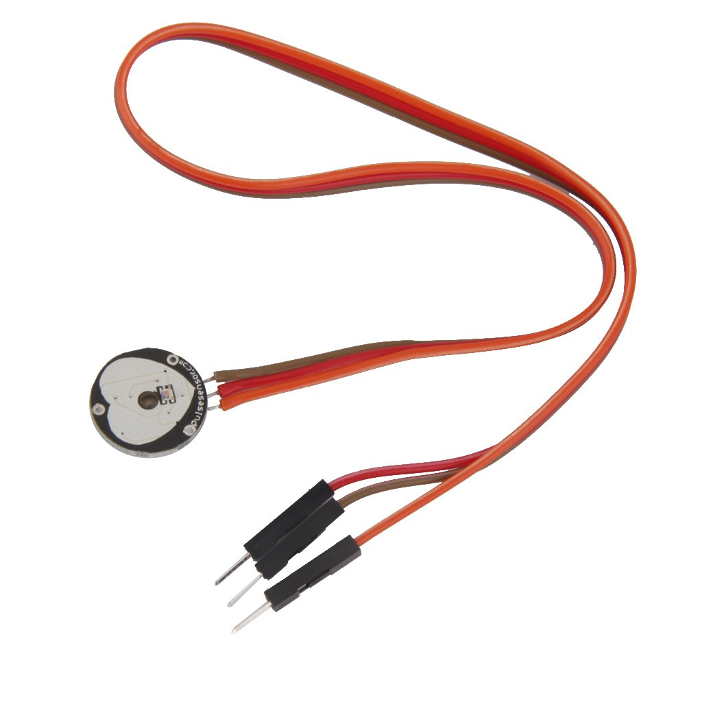
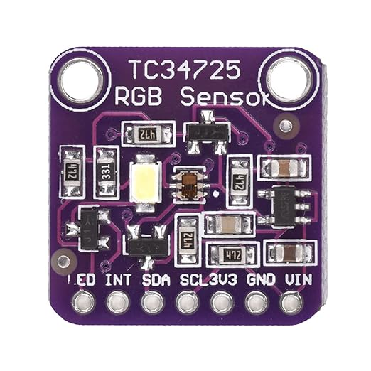
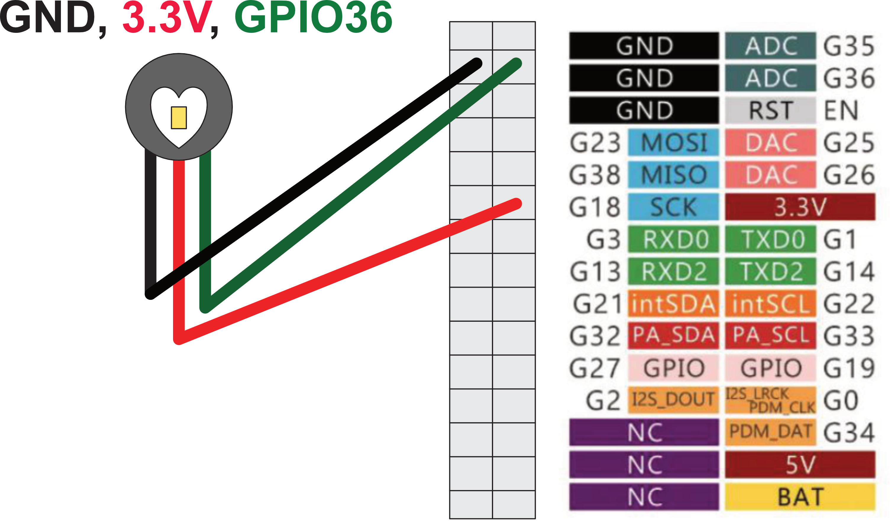
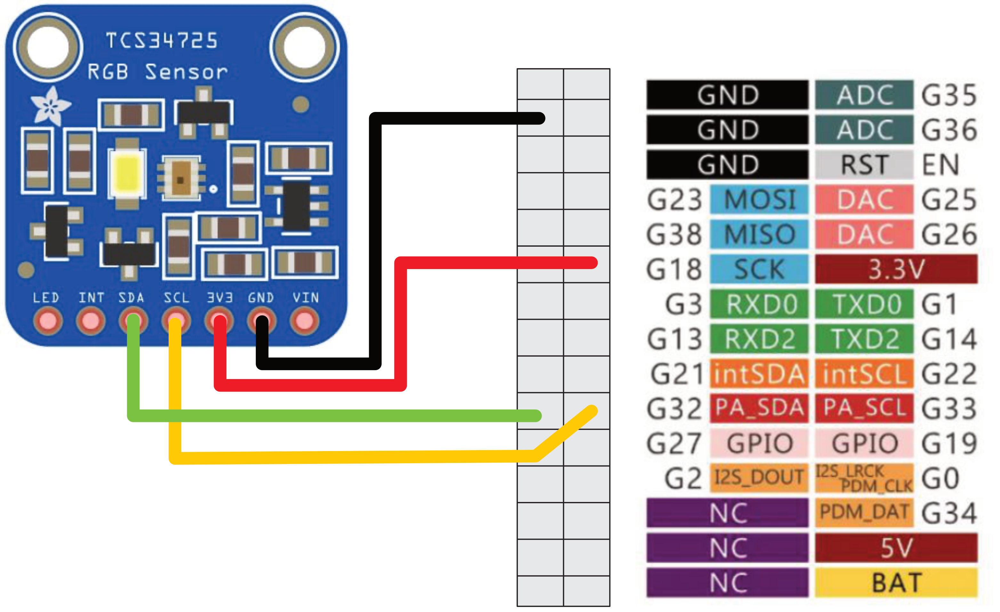

<!-- _class: lead -->
2025年後期

# 情報学実験B
## 実世界センシング＆ビジュアライゼーション

フィジカルコンピューティングチーム
担当教員：菊池、遠藤


---
# 目次

1. [情報学実験B](#情報学実験b)
2. [イントロダクション](#イントロダクション)
3. [実験概要](#実験概要)
4. [教員&TASAの紹介](#教員tasaの紹介)
5. [環境構築](#環境構築)
6. [センサを使ってみよう](#センサを使ってみよう)
7. [超音波距離センサの使い方](#超音波距離センサの使い方)
8. [心拍センサの使い方](#心拍センサの使い方)
9. [カラーセンサの使い方](#カラーセンサの使い方)
10. [チャレンジ](#チャレンジ)

---
<!-- _class: lead -->
略称(スライド内では下記のように読み替えてください)

P5 = Processing
M5 = M5Stack, M5Stack Core2
VSC = VS Code
PIO = PlatformIO


---
<!-- _class: lead -->
### 実世界センシング＆ビジュアライゼーション
# イントロダクション


---
## 本実験の概要
実世界における空間や事象、人やものなど、普段何気なく認識知覚している物事をセンサを用いて観測することで、環境や現象をデータとして再認識する。

そして、観測したデータをビジュアライズ(可視化)することで、
実世界の空間や事象をコンピュータの中(仮想世界)で再構築する。

---
## 実世界をセンシングするとは
<br>

### 実世界　＝　現実として存在する世界、我々が生活する空間
<br>

### センシング　＝ センサを使って温度、振動、画像、生体情報などの物理的・化学的・生物的特性を検出し、定量的な情報として取得する技術

---
## 実世界で観測できる情報(一部)
<br>


---
## IoT・スマートセンシング


IoTNEWS：https://iotnews.jp/smart-city/1218/

---
## デジタルツイン・サイバーフィジカルシステム


村田製作所：https://article.murata.com/ja-jp/article/digital-twin-that-recreates-twins

---
## ビジュアライゼーションとは
ビジュアライゼーションとは、人間が直接「見る」ことのできない現象・事象・関係性を「見る」ことを可能にする(可視化) こと。視覚化・可視化情報化・視覚情報化ともいう。


---
## ビジュアライゼーションの例1
[Takram. 東京の未来を考えるための人口推移データの可視化](https://www.takram.com/ja/projects/tokyo-urban-studies)


---
## ビジュアライゼーションの例2
[Yukari Nagata. Twitter Analysis : つぶやきの分布](https://public.tableau.com/app/profile/yukari.nagata0623/viz/TwitterAnalysis_15595641262440/sheet0)


---
## ビジュアライゼーションの例3
[CCBT:
Future Ideations Camp Vol.4「生態系をデータとしてとらえる／表現する」](https://ccbt.rekibun.or.jp/events/camp04__exhibition)


---
<!-- _class: lead -->
### 実世界センシング＆ビジュアライゼーション
# 実験概要


---
## 実験詳細
- ESP32マイコンの環境構築&プログラミング(C言語)について
- 各種センサの使用方法(プログラミング&回路作成)
- センサデータの記録保存方法
- センサデータのグラフプロット
- データの可視化方法＆プログラミング(Java)
- 環境データの可視化＆生体データの可視化
- ビジュアライズ作品のアイディア出し＆センサデータ選定
- データ収集フィールドワーク
- ビジュアライゼーション作品の制作
- 実験レポート作成

---
## 実験スケジュール
- 1週目：導入＆実験準備
    - 実験概要説明＆環境構築
    - M5のサンプルコード動作確認
    - センサーのサンプルコードテスト
- 2週目：データ保存＆ビジュアライゼーション手法
    - SDへのデータ保存＆センサデータのSD保存
    - ビジュアライゼーション手法＆サンプル

- 3週目：ビジュアライゼーションのアイディア出し
    - アイディア出し
    - アイディアチェック＆修正

---
- 4週目：センシングデバイスのプロトタイプ実装
    - M5センサの実装＆データ保存の確認
    - 可視化プロトタイプ実装＆ダミーデータテスト
- 5週目：実世界フィールドワーク 
    - 学内でデータ収集実験
    - データの確認＆追加実験
- 6週目：ビジュアライゼーション制作
    - ビジュアライゼーション制作1
    - ビジュアライゼーション制作2

- 休み期間：(学祭 or 冬休み)

- 7週目：予備日(追実験＆レポート作成)
    - レポート作成

---
## 学内フィールドワーク


---
## 実験機材
- [ESP32マイコン：M5Stack Core2](https://docs.m5stack.com/ja/core/core2)
- 各種センサ


---
## 開発環境
[Platform IO](https://platformio.org/) in [VS Code](https://code.visualstudio.com/)

[Processing](https://processing.org/) Java or p5.js

<br>

 


---
## 実験を行う前の注意点
- 実験機材は最新の注意を払って扱うこと
- 電子機器、回路を扱うので、水分が付いた手で扱わないこと(感電します)
- PCの上でマイコン、電子機器を扱わないこと(ショートします)

<br>

- ChatGPTや生成AIの使用について
    - コードの実装には使っていい
    - レポートには使っちゃダメ
    - 生成AIはコードが脱線するから1から作り直しになることもある
    - 生成AIより教員とSA/TAを頼って


---
## レポートについて
- 各回の実験内容をレポートにまとめる
- 実験環境や実験機材など細かく記載する
- 実験の様子など正確に撮影し、レポートに図として取り入れる
- 制作したビジュアライゼーション作品についてレポートでまとめる
(コンセプト、実装方法、実験環境、ビジュアライズの方法など)

<br>

- レポート作成時に、実験内容を思い出せるように、ノートを用意し各回メモを取ること。

---
## 本日の課題

本日の実験内容を実験ノートにまとめ、最終レポートに備え、小レポートを作成する。

小レポート内容：下記項目について写真や図などを入れ、まとめる
- センサ技術が使用されている分野ついて
- データビジュアライゼーションについて
- 開発環境と使用機材について
- 各種センサの使用方法と取得できるデータについて

<br>
小レポートの提出はしなくて良いが、最終レポートに備え作成することを推奨する。

---
<!-- _class: lead -->
# 教員&TASAの紹介
<br>

## 教員の紹介
#### 担当教員：菊池康太
#### 非常勤講師：遠藤勝也

<br>

## TA・SAの紹介

#### TA：大学院修士1年　岸野さん
#### SA：学部3年　太田さん


---
<!-- _class: lead -->
### 実世界センシング＆ビジュアライゼーション
# 環境構築


---
## PlatformIO の環境構築

VS Codeを開いて、左メニューの①Extensions(拡張機能)から、②PlatformIOを検索し、③選択し「インストール」をクリックする。
 

---
インストールが完了すると、左メニューにPIOのロゴが出現する。
これでインストールはOK
 

---
①PIOのロゴをクリックし、②”Create New Project”、③”New Project”から新しいプロジェクトを作成する。

 

---
Name: **m5-test**
Board: **M5Stack Core ESP32**
Framework: **Arduino**
Location☑️から保存先をデフォルトか任意のディレクトリに変更できる。
デスクトップに「**meisei-exb2025**」フォルダを作成し、そこに保存しましょう。

設定できたら「Finish」をクリック


---
#### プロジェクト作成の画面


---
#### ディレクトリ構成
m5-test/
├── platformio.ini（**libraryなどの設定ファイル**）
├── src/
│   └── main.cpp（**メインとなるプログラム**）
├── include/
│   └── README
├── lib/
│   └── README
├── test/
│   └── README
├── .vscode/
│   └── （VSCode設定ファイル群）
├── .pio/
│   └── （PlatformIOビルド成果物）

---
## サンプルコードを書き込んでみよう
次ページにコードをsrc/main.cppに書き込んでみよう。
こちらのGithubにも同じコードがあります。

https://github.com/kikpond15/is-lab-b/blob/main/projects/01_hello_m5/src/main.cpp


---
## サンプルコードを書き込んでみよう

```c++
// https://github.com/kikpond15/is-lab-b/blob/main/projects/01_hello_m5/src/main.cpp
#include <M5Unified.h>

void setup() {
  auto cfg = M5.config();      // M5Unifiedが機種差を吸収
  M5.begin(cfg);
  M5.Display.setRotation(1);   // 横向き
  M5.Display.setTextSize(2);
  M5.Display.clear();
  M5.Display.println("Hello, M5!");
}

void loop() {
  M5.update();                  // ボタン/タッチ等の状態更新
  String msg1 = "";
  // Core2のタッチ例（Basicでも安全に呼べる）
  auto t = M5.Touch.getDetail();
  if (t.isPressed()) {
    msg1 = "Touch: " + String(t.x) + "," + String(t.y);
  }
  M5.Display.drawString(msg1, 0, 40);  //画面に表示

  String msg2 = "";
  // Basic: A/B/C ボタン、Core2: タッチ
  if (M5.BtnA.wasPressed())     msg2 = "BtnA pressed";
  if (M5.BtnB.wasPressed())     msg2 = "BtnB pressed";
  if (M5.BtnC.wasPressed())     msg2 = "BtnC pressed";
  M5.Display.drawString(msg2, 0, 60);
  delay(10);
}
```

---
## サンプルコードを書き込んでみよう
まだlibraryをインストールしていないので、一行目の```#include <M5Unified.h>```で
エラーが出るかと思います。

libraryを追加するには2つの方法があります。1つ目は下図のようにPIO HOMEから直接インストールする方法。


---
もう1つは、platformio.iniに追加したいライブラリを書き込む方法。
Platformio.iniは　ライブラリやその他マイコンのボード情報など、設定に必要な情報を管理する。

```ini
[platformio]
default_envs = m5core2
[env]                       ; 共通設定
platform = espressif32@6.5.0
framework = arduino
monitor_speed = 115200
; 共有インクルード/ライブラリ（相対パス）
lib_extra_dirs = ../../shared/lib
build_flags    = -I ../../shared/include
; 外部依存（バージョン固定推奨）
lib_deps =
  m5stack/M5Unified@^0.1.15
  m5stack/M5GFX@^0.1.15
[env:m5core2]
board = m5stack-core2
build_flags =
  ${env.build_flags}
  -D M5UNIFIED
  -D TARGET_M5CORE2
```

---
## コンパイル＆M5に書き込みしてみよう
コードの作成＆リアブラリの設定が完了したら、**コンパイル**してみよう。
コンパイル：作成したコードなどをコンピュータが理解でできる機械語やバイナリに変換しエラーがないかチェックする処理。

**コンパイル：Ctrl + option + b (VSC下部にある☑️マークからでもOK)**
ターミナル画面に **[SUCCESS]** が表示されればOK

---
## コンパイル＆M5に書き込みしてみよう
コンパイルが成功したら、M5にアップロードしてみよう。
PCとM5をUSBケーブルで接続し、アップロードしましょう。

**アップロード：Ctrl + option + u（VSC下部にある→マークからでもOK）**
ターミナル画面に **[SUCCESS]** が表示されればOK


---
## コンパイル＆M5に書き込みしてみよう
ディスプレイ下部の⭕️ボタンや、ディスプレを触ると、触っている箇所の座標が表示される。


---
<!-- _class: lead -->

これでPIOの環境構築は完了です。

上記の手順でM5のプログラム作成から、アップロード、実機動作までを行いました。

忘れないように、ノートにメモをとっておきましょう。

---
<!-- _class: lead -->
### 実世界センシング＆ビジュアライゼーション
# センサを使ってみよう


---
## M5でセンサを使うには
M5Core2の背面には、GPIO(General-Purpose Input/Output)があり、そこから電気を流したり、センサの値を読み取ったりすることができる。
各センサは、GPIOのどこに接続すれば良いかが決まっている。
間違えるとショートしたり、ICが壊れて煙が出るので注意しよう！
<br>




---
## 使用するセンサ紹介
###  超音波距離センサ
超音波パルス（人間には聞こえない高周波音）を発射し、その反射音が戻ってくるまでの時間を計測して距離を求めるセンサです。安価で扱いやすく、数cm〜数mの測距が可能です。ロボットの障害物検知、距離測定、液面計測などによく使われます。


---
## 使用するセンサ紹介
### 心拍センサ
人の脈拍（心拍数）を光学的または電気的に検出するセンサです。光学式（PPG）はLEDの光を皮膚に当てて血流変化を読み取り、電極式は微小な電位差を計測します。ウェアラブル機器やヘルスケア機器に使われます。


---
## 使用するセンサ紹介
### カラーセンサ
光の赤・緑・青などの成分を検出し、対象物や環境の色を数値化するセンサです。TCS34725のようなセンサではR・G・B・クリア（明るさ）を個別に取得でき、照明制御や色認識ロボット、品質検査などに使われます。


---
## GitHubからサンプルコードをダウンロードしよう

ここからダウンロードする→https://github.com/kikpond15/is-lab-b
リンク先のリポジトリをZipでダウンロードし、デスクトップの**meisei-exb2025**に解凍する。


---
**projectsフォルダ**の中に、サンプルコードが複数あります。
今回使うのは、

**04_ultrasonic**
**02_heartbeat**
**05_color_sensor**

VSCを新規で立ち上げて(Ctrl + Shift + n)、04_ultrasonicフォルダを開いてみよう。

---
<!-- _class: lead -->
### 実世界センシング＆ビジュアライゼーション
# 超音波距離センサの使い方

---
## 距離センサの配線


---
配線できたら、04_ultrasonicのコードをM5にアップロードしてみよう。
(HCSR04クラスに詳しい処理が入っている)

```c++
//main.cpp
#include <Arduino.h>
#include <M5Unified.h>
#include "HCSR04.h"

const int trig_pin = G25;
const int echo_pin = G35;
HCSR04 hcsr04;

void setup() {
  m5::M5Unified::config_t cfg = M5.config();
  M5.begin(cfg);
  Serial.begin(115200);

  M5.Display.setTextSize(2);
  M5.Display.setTextColor(TFT_WHITE, TFT_BLACK);
  M5.Display.clear();

  hcsr04.begin(trig_pin, echo_pin);
}

void loop() {
  M5.update();
  float dist = hcsr04.distance();

  M5.Display.setCursor(0, 0);
  M5.Display.printf("distance: %6.2fcm", dist);
  Serial.println(dist);
  delay(10);
}

```
---
<br><br>

センサの正面にある物との距離をcmで画面に表示する。
曲面などは距離が計りにくい。何メートルまで計測できるか試してみよう。


---
<!-- _class: lead -->
### 実世界センシング＆ビジュアライゼーション
# 心拍センサの使い方

---
## 心拍センサの配線
心拍センサは、ハートマークを上にした時に、左からGND、3.3V, シグナルピン(GPIO36)の順に並んでいる。M5の背面に配線してみよう。
<br>



---
配線できたら、02_heartbeatのコードをM5にアップロードしてみよう。
```c++
//https://www.switch-science.com/products/1135
#include <M5Unified.h>

void setup() {
  auto cfg = M5.config();      // M5Unifiedが機種差を吸収
  M5.begin(cfg);
  Serial.begin(115200); //シリアルモニタ用

  M5.Display.setTextSize(2);
  M5.Display.setTextColor(TFT_WHITE, TFT_BLACK);
  M5.Display.clear();
}

void loop() {
  M5.update();
  int heartbeat = analogRead(36);//GPIO36(ADC1_CH0)を使用
  //画面に表示
  String msg = "heartbeat: " + String(heartbeat);
  M5.Display.drawString(msg, 0, 40);

  //シリアルモニタに表示(VSCodeの場合"Teleplot"で確認可能)
  Serial.printf(">heartbeat:%d\n", heartbeat); //グラフ確認
  // Serial.printf("heartbeat:%d\n", heartbeat); //数値確認のみ
  delay(10); 
}

```
M5の画面に心拍センサで計測した数値が出てきます。ハートマークの面に指先をおいてみましょう。

---
## シリアルモニタを使ってグラフにしてみよう。
数値だけだと分かりにくいので、グラフにプロットしてみよう。
VSCの**Extensions**から**Teleplot**を追加してみよう。


---
VSC下部にTeleplotが追加されるので、クリックして開く


---
SerialのプルダウンメニューからM5のポートを選択し、**Open**する。
M5から心拍のデータがシリアル通信経由でVSCに送られ、Teleplotでグラフとしてリアルタイムに確認できる。
<br>


---
<!-- _class: lead -->
### 実世界センシング＆ビジュアライゼーション
# カラーセンサの使い方

---
## カラーセンサの配線
使用するTCS343725は、[I2C通信](https://techweb.rohm.co.jp/product/micon/micons/23805/)でM5とデータの通信を行う。
互いのSDAとSCLをそれぞれ接続する。(M5側は32、33ピン)



---
<br>

TCS343725用のライブラリを**platformio.ini**に追加しよう。

```ini
; 外部依存（バージョン固定推奨）
lib_deps =
  m5stack/M5Unified@^0.1.15
  m5stack/M5GFX@^0.1.15
  
  adafruit/Adafruit TCS34725@^1.4.4 ;カラーセンサのライブラリを追加
```

---
配線できたら、05_color_sensorのコードをM5にアップロードしてみよう。

```c++
#include <Wire.h>                     // I2C通信ライブラリ
#include <Adafruit_TCS34725.h>         // カラーセンサTCS34725用ライブラリ
#include <M5Unified.h>                 // M5Stack用統合ライブラリ

// 積分時間614ms・ゲイン1xで初期化（高精度測定）
Adafruit_TCS34725 tcs = Adafruit_TCS34725(TCS34725_INTEGRATIONTIME_614MS, TCS34725_GAIN_1X);

void setup(void) {
  Serial.begin(9600);
  M5.begin();
  M5.Lcd.setRotation(1);
  M5.Lcd.fillScreen(BLACK);
  M5.Lcd.setTextSize(3);
  M5.Lcd.setTextColor(WHITE);
  // カラーセンサ初期化
  if (tcs.begin()) {               // センサが見つかった場合
    M5.Lcd.setCursor(10, 10);
    M5.Lcd.println("TCS34725 OK");
  } else {                         // センサが見つからなかった場合               
    M5.Lcd.setCursor(10, 10); 
    M5.Lcd.println("Sensor Error");
    while (1);
  }
}

void loop(void) {
  uint16_t r, g, b, c, colorTemp, lux;  // 生データ格納用変数
  tcs.getRawData(&r, &g, &b, &c); // 生データ取得（赤・緑・青・クリア）
  colorTemp = tcs.calculateColorTemperature_dn40(r, g, b, c); // 色温度・照度の計算（必要に応じて使える）
  lux = tcs.calculateLux(r, g, b);

  uint8_t R, G, B;  // 明るさ（クリア値c）で正規化して0-255のRGB値に変換
  if (c > 0) {
    R = (uint32_t)r * 255 / c; // 赤成分を正規化
    G = (uint32_t)g * 255 / c; // 緑成分を正規化
    B = (uint32_t)b * 255 / c; // 青成分を正規化
  } else {
    R = G = B = 0; // クリア値0のときは0
  }

  M5.Lcd.fillRect(0, 50, 320, 200, BLACK);  // 表示更新領域をクリア（黒塗り）
  // RGB値を画面に表示
  M5.Lcd.setCursor(10, 60);
  M5.Lcd.printf("R: %d", R);
  M5.Lcd.setCursor(10, 100);
  M5.Lcd.printf("G: %d", G);
  M5.Lcd.setCursor(10, 140);
  M5.Lcd.printf("B: %d", B);

  delay(500);
}

```

---
<br>

カラーセンサから読み取った色の値が、画面にRGBで表示されればOK

---
<!-- _class: lead -->
## チャレンジ
M5のディスプレイの色を、読み取った色にしてみよう。


