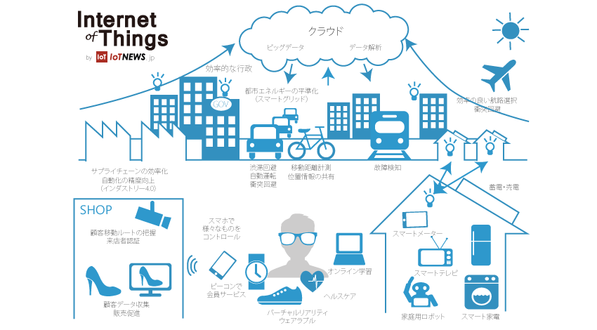
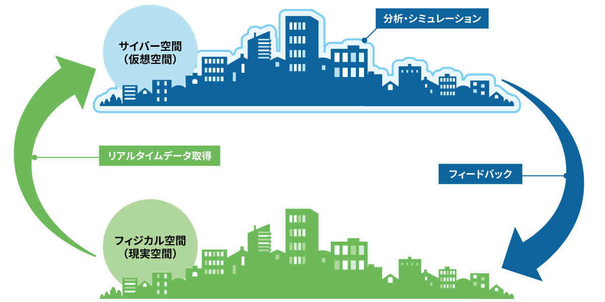
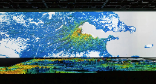
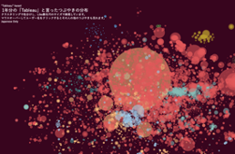
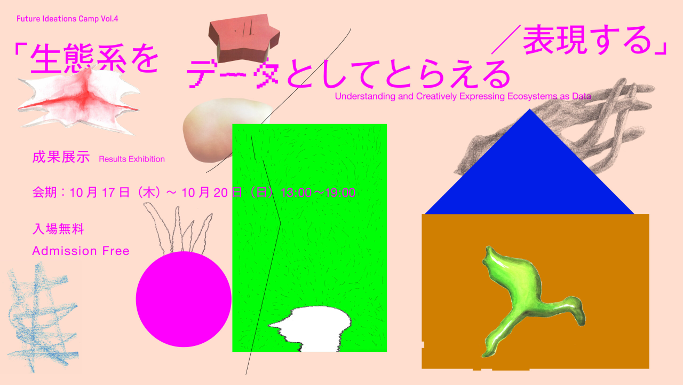
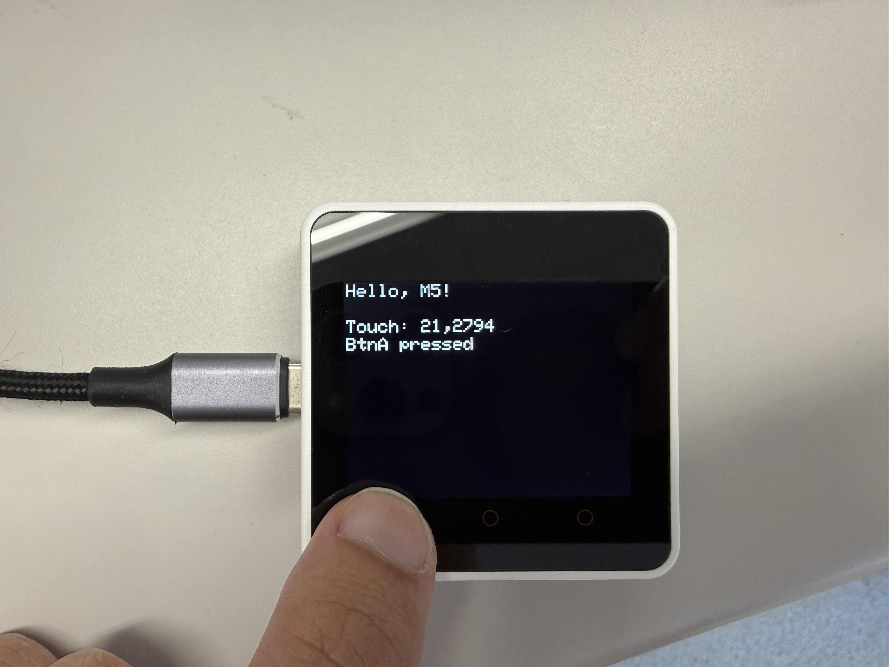

<!-- _class: lead -->
2025年後期

# 情報学実験B
## 実世界センシング＆ビジュアライゼーション

フィジカルコンピューティングチーム
担当教員：菊池、遠藤


---
## 目次
1. [2025年後期 情報学実験B](#2025年後期-情報学実験b)
2. [実世界センシング＆ビジュアライゼーション イントロダクション](#実世界センシングビジュアライゼーション-イントロダクション)
3. [実世界センシング＆ビジュアライゼーション 実験概要](#実世界センシングビジュアライゼーション-実験概要)
4. [教員 & TA・SA の紹介](#教員-ta・sa-の紹介)
5. [実世界センシング＆ビジュアライゼーション 環境構築](#実世界センシングビジュアライゼーション-環境構築)

<br>

略称(スライド内では下記のように読み替えてください)
  - P5 = Processing
  - M5 = M5Stack, M5Stack Core2
  - VSC = VS Code
  - PIO = PlatformIO


---
<!-- _class: lead -->
### 実世界センシング＆ビジュアライゼーション
# イントロダクション


---
## 本実験の概要
実世界における空間や事象、人やものなど、普段何気なく認識知覚している物事をセンサを用いて観測することで、環境や現象をデータとして再認識する。

そして、観測したデータをビジュアライズ(可視化)することで、
実世界の空間や事象をコンピュータの中(仮想世界)で再構築する。

---
## 実世界をセンシングするとは
<br>

### 実世界　＝　現実として存在する世界、我々が生活する空間
<br>

### センシング　＝ センサを使って温度、振動、画像、生体情報などの物理的・化学的・生物的特性を検出し、定量的な情報として取得する技術

---
## 実世界で観測できる情報(一部)
<br>


---
## IoT・スマートセンシング


IoTNEWS：https://iotnews.jp/smart-city/1218/

---
## デジタルツイン・サイバーフィジカルシステム


村田製作所：https://article.murata.com/ja-jp/article/digital-twin-that-recreates-twins

---
## ビジュアライゼーションとは
ビジュアライゼーションとは、人間が直接「見る」ことのできない現象・事象・関係性を「見る」ことを可能にする(可視化) こと。視覚化・可視化情報化・視覚情報化ともいう。


---
## ビジュアライゼーションの例1
[Takram. 東京の未来を考えるための人口推移データの可視化](https://www.takram.com/ja/projects/tokyo-urban-studies)



---
## ビジュアライゼーションの例2
[Yukari Nagata. Twitter Analysis : つぶやきの分布](https://public.tableau.com/app/profile/yukari.nagata0623/viz/TwitterAnalysis_15595641262440/sheet0)



---
## ビジュアライゼーションの例3
[CCBT:
Future Ideations Camp Vol.4「生態系をデータとしてとらえる／表現する」](https://ccbt.rekibun.or.jp/events/camp04__exhibition)



---
<!-- _class: lead -->
### 実世界センシング＆ビジュアライゼーション
# 実験概要


---
## 実験詳細
- ESP32マイコンの環境構築&プログラミング(C言語)について
- 各種センサの使用方法(プログラミング&回路作成)
- センサデータの記録保存方法
- センサデータのグラフプロット
- データの可視化方法＆プログラミング(Java)
- 環境データの可視化＆生体データの可視化
- ビジュアライズ作品のアイディア出し＆センサデータ選定
- データ収集フィールドワーク
- ビジュアライゼーション作品の制作
- 実験レポート作成

---
## 実験スケジュール
- 1週目：導入＆実験準備
    - 実験概要説明＆環境構築
    - M5のサンプルコード動作確認
    - センサーのサンプルコードテスト
- 2週目：データ保存＆ビジュアライゼーション手法
    - SDへのデータ保存＆センサデータのSD保存
    - ビジュアライゼーション手法＆サンプル

- 3週目：ビジュアライゼーションのアイディア出し
    - アイディア出し
    - アイディアチェック＆修正

---
- 4週目：センシングデバイスのプロトタイプ実装
    - M5センサの実装＆データ保存の確認
    - 可視化プロトタイプ実装＆ダミーデータテスト
- 5週目：実世界フィールドワーク 
    - 学内でデータ収集実験
    - データの確認＆追加実験
- 6週目：ビジュアライゼーション制作
    - ビジュアライゼーション制作1
    - ビジュアライゼーション制作2

- 休み期間：(学祭 or 冬休み)

- 7週目：予備日(追実験＆レポート作成)
    - レポート作成

---
## 学内フィールドワーク


---
## 実験機材
- [ESP32マイコン：M5Stack Core2](https://docs.m5stack.com/ja/core/core2)
- 各種センサ


---
## 開発環境
[Platform IO](https://platformio.org/) in [VS Code](https://code.visualstudio.com/)

[Processing](https://processing.org/) Java or p5.js

<br>

 


---
## 実験を行う前の注意点
- 実験機材は最新の注意を払って扱うこと
- 電子機器、回路を扱うので、水分が付いた手で扱わないこと(感電します)
- PCの上でマイコン、電子機器を扱わないこと(ショートします)

<br>

- ChatGPTや生成AIの使用について
    - コードの実装には使っていい
    - レポートには使っちゃダメ
    - 生成AIはコードが脱線するから1から作り直しになることもある
    - 生成AIより教員とSA/TAを頼って


---
## レポートについて
- 各回の実験内容をレポートにまとめる
- 実験環境や実験機材など細かく記載する
- 実験の様子など正確に撮影し、レポートに図として取り入れる
- 制作したビジュアライゼーション作品についてレポートでまとめる
(コンセプト、実装方法、実験環境、ビジュアライズの方法など)


- レポート作成時に、実験内容を思い出せるように、
ノートを用意し各回メモを取ること。

---
<!-- _class: lead -->
# 教員&TASAの紹介
<br>

## 教員の紹介
#### 担当教員：菊池康太
#### 非常勤講師：遠藤勝也

<br>

## TA・SAの紹介

#### TA：大学院修士1年　岸野さん
#### SA：学部3年　太田さん


---
<!-- _class: lead -->
### 実世界センシング＆ビジュアライゼーション
# 環境構築


---
## PlatformIO の環境構築

VS Codeを開いて、左メニューの①Extensions(拡張機能)から、②PlatformIOを検索し、③選択し「インストール」をクリックする。
 

---
インストールが完了すると、左メニューにPIOのロゴが出現する。
これでインストールはOK
 

---
①PIOのロゴをクリックし、②”Create New Project”、③”New Project”から新しいプロジェクトを作成する。

 

---
Name: **m5-test**
Board: **M5Stack Core ESP32**
Framework: **Arduino**
Location☑️から保存先をデフォルトか任意のディレクトリに変更できる。
デスクトップに「**meisei-exb2025**」フォルダを作成し、そこに保存しましょう。

設定できたら「Finish」をクリック


---
#### プロジェクト作成の画面


---
#### ディレクトリ構成
m5-test/
├── platformio.ini（**libraryなどの設定ファイル**）
├── src/
│   └── main.cpp（**メインとなるプログラム**）
├── include/
│   └── README
├── lib/
│   └── README
├── test/
│   └── README
├── .vscode/
│   └── （VSCode設定ファイル群）
├── .pio/
│   └── （PlatformIOビルド成果物）

---
## サンプルコードを書き込んでみよう
次ページにコードをsrc/main.cppに書き込んでみよう。
こちらのGithubにも同じコードがあります。

https://github.com/kikpond15/is-lab-b/blob/main/projects/01_hello_m5/src/main.cpp


---
## サンプルコードを書き込んでみよう

```c++
// https://github.com/kikpond15/is-lab-b/blob/main/projects/01_hello_m5/src/main.cpp
#include <M5Unified.h>

void setup() {
  auto cfg = M5.config();      // M5Unifiedが機種差を吸収
  M5.begin(cfg);
  M5.Display.setRotation(1);   // 横向き
  M5.Display.setTextSize(2);
  M5.Display.clear();
  M5.Display.println("Hello, M5!");
}

void loop() {
  M5.update();                  // ボタン/タッチ等の状態更新
  String msg1 = "";
  // Core2のタッチ例（Basicでも安全に呼べる）
  auto t = M5.Touch.getDetail();
  if (t.isPressed()) {
    msg1 = "Touch: " + String(t.x) + "," + String(t.y);
  }
  M5.Display.drawString(msg1, 0, 40);  //画面に表示

  String msg2 = "";
  // Basic: A/B/C ボタン、Core2: タッチ
  if (M5.BtnA.wasPressed())     msg2 = "BtnA pressed";
  if (M5.BtnB.wasPressed())     msg2 = "BtnB pressed";
  if (M5.BtnC.wasPressed())     msg2 = "BtnC pressed";
  M5.Display.drawString(msg2, 0, 60);
  delay(10);
}
```

---
## サンプルコードを書き込んでみよう
まだlibraryをインストールしていないので、一行目の```#include <M5Unified.h>```で
エラーが出るかと思います。

libraryを追加するには2つの方法があります。1つ目は下図のようにPIO HOMEから直接インストールする方法。


---
もう1つは、platformio.iniに追加したいライブラリを書き込む方法。
Platformio.iniは　ライブラリやその他マイコンのボード情報など、設定に必要な情報を管理する。

```ini
[platformio]
default_envs = m5core2
[env]                       ; 共通設定
platform = espressif32@6.5.0
framework = arduino
monitor_speed = 115200
; 共有インクルード/ライブラリ（相対パス）
lib_extra_dirs = ../../shared/lib
build_flags    = -I ../../shared/include
; 外部依存（バージョン固定推奨）
lib_deps =
  m5stack/M5Unified@^0.1.15
  m5stack/M5GFX@^0.1.15
[env:m5core2]
board = m5stack-core2
build_flags =
  ${env.build_flags}
  -D M5UNIFIED
  -D TARGET_M5CORE2
```

---
## コンパイル＆M5に書き込みしてみよう
コードの作成＆リアブラリの設定が完了したら、**コンパイル**してみよう。
コンパイル：作成したコードなどをコンピュータが理解でできる機械語やバイナリに変換しエラーがないかチェックする処理。

**コンパイル：Ctrl + option + b (VSC下部にある☑️マークからでもOK)**
ターミナル画面に **[SUCCESS]** が表示されればOK

---
## コンパイル＆M5に書き込みしてみよう
コンパイルが成功したら、M5にアップロードしてみよう。
PCとM5をUSBケーブルで接続し、アップロードしましょう。

**アップロード：Ctrl + option + u（VSC下部にある→マークからでもOK）**
ターミナル画面に **[SUCCESS]** が表示されればOK


---
## コンパイル＆M5に書き込みしてみよう
ディスプレイ下部の⭕️ボタンや、ディスプレを触ると、触っている箇所の座標が表示される。



---
<!-- _class: lead -->

これでPIOの環境構築は完了です。

上記の手順でM5のプログラム作成から、アップロード、実機動作までを行いました。

忘れないように、ノートにメモをとっておきましょう。

---


