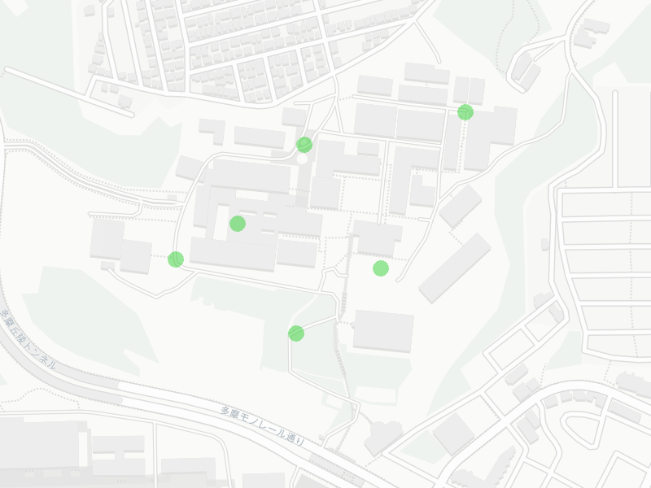

<!-- _class: lead -->
2025年後期

# 情報学実験B
## 実世界センシング＆ビジュアライゼーション
## Chapter 2

フィジカルコンピューティングチーム
担当教員：菊池、遠藤


---
# 目次

1. [外部ストレージ(SDカード)へのデータ保存](#外部ストレージへのデータ保存)
2. [外部ストレージ(SDカード)へのセンサデータ保存](#センサデータ保存)
3. [センサデータのビジュアライゼーション](#センサデータのビジュアライゼーション)
4. [データを音に変換する (Sonification)](#データを音に変換する)
5. [地図上にデータをマップする](#地図上にデータをマップする)
6. [チャレンジ](#チャレンジ)

---
<!-- _class: lead -->
略称(スライド内では下記のように読み替えてください)

P5 = Processing
M5 = M5Stack, M5Stack Core2
VSC = VS Code
PIO = PlatformIO
PG = プログラム
<br>

サンプルプログラムは下記のGitHubリポジトリにあります。
https://github.com/kikpond15/is-lab-b

---
## 実験スケジュール
- 1週目：導入＆実験準備
    - 実験概要説明＆環境構築
    - M5のサンプルコード動作確認
    - センサーのサンプルコードテスト
- 2週目：データ保存＆ビジュアライゼーション手法
    - SDへのデータ保存＆センサデータのSD保存
    - ビジュアライゼーション手法＆サンプル

- 3週目：ビジュアライゼーションのアイディア出し
    - アイディア出し
    - アイディアチェック＆修正

---
- 4週目：センシングデバイスのプロトタイプ実装
    - M5センサの実装＆データ保存の確認
    - 可視化プロトタイプ実装＆ダミーデータテスト
- 5週目：実世界フィールドワーク 
    - 学内でデータ収集実験
    - データの確認＆追加実験
- 6週目：ビジュアライゼーション制作
    - ビジュアライゼーション制作1
    - ビジュアライゼーション制作2

- 休み期間：(学祭 or 冬休み)

- 7週目：予備日(追実験＆レポート作成)
    - レポート作成

---
## 実験を行う前の注意点
- 実験機材は最新の注意を払って扱うこと
- 電子機器、回路を扱うので、水分が付いた手で扱わないこと(感電します)
- PCの上でマイコン、電子機器を扱わないこと(ショートします)

<br>

- ChatGPTや生成AIの使用について
    - コードの実装には使っていい
    - レポートには使っちゃダメ
    - 生成AIはコードが脱線するから1から作り直しになることもある
    - 生成AIより教員とSA/TAを頼って


---
## レポートについて
- 各回の実験内容をレポートにまとめる
- 実験環境や実験機材など細かく記載する
- 実験の様子など正確に撮影し、レポートに図として取り入れる
- 制作したビジュアライゼーション作品についてレポートでまとめる
(コンセプト、実装方法、実験環境、ビジュアライズの方法など)

<br>

- レポート作成時に、実験内容を思い出せるように、ノートを用意し各回メモを取ること。

---
## 本日の課題

本日の実験内容を実験ノートにまとめ、最終レポートに備え、小レポートを作成する。

小レポート内容：下記項目について写真や図などを入れ、まとめる

- マイコンでデータを保存する方法について
- processingで保存したデータを扱う方法について
- 地図上にデータをマップする方法について
(実際に実験した様子や、制作したプログラムなどもあれば)

<br>
小レポートの提出はしなくて良いが、最終レポートに備え作成することを推奨する。


---
<!-- _class: lead -->
<a id="外部ストレージへのデータ保存"></a> 

### 実世界センシング＆ビジュアライゼーション
# マイコンを使った
# 外部ストレージへのデータ保存

---
## M5の保存領域
### 内部メモリ（SRAM/PSRAM）　
- SRAM（520KB
    - プログラムの実行中に一時的に変数やバッファを保持、電源を切ると消える
- PSRAM（8MB）
    - 大きめのデータ（画像やログの一時保存）を格納可能。電源を切ると消える
### 内蔵フラッシュ（16MB）
- プログラム自体や、SPIFFS / LittleFS というフラッシュファイルシステムを使って小規模なファイル保存が可能
- 頻繁な書き込みには向いていない（フラッシュは書き換え寿命があるため）
### 外部ストレージ（SDカード）
- microSDカードスロットがある（最大16GB程度が安定して動作）
- SD.h や FS.h ライブラリを使って、CSVやテキスト形式でセンサーデータを保存可能。

---
## イベント駆動型のデータ保存（離散的）
サンプルプログラム03_save_sdを使ってデータを**SDカード**に保存してみよう。

```c++
#include <M5Unified.h>
#include <SD.h>
File sdcard;

// 関数のプロトタイプ宣言
void logButton(char btn);

void setup() {
  auto cfg = M5.config();      // M5Unifiedが機種差を吸収
  M5.begin(cfg);
  // Display初期化
  M5.Display.setTextSize(2);
  M5.Display.setTextColor(TFT_WHITE, TFT_BLACK);
  M5.Display.clear();
  M5.Display.println("Save to SD");
  M5.Display.println("Logging Start");

  SD.begin(4, SPI, 40000000); // SDカード初期化(CSピン4, SPIクロック40MHz)
  sdcard = SD.open("/m5.csv", FILE_WRITE); // 追記モードでオープン
  sdcard.println("time,button"); // ヘッダー行書き込み
  sdcard.flush();
}
```
※下記に続く

---
```c++
void loop() {
  M5.update();  //状態更新
  // A/B/C ボタンの押下を検出
  if (M5.BtnA.wasPressed()) logButton('A');
  if (M5.BtnB.wasPressed()) logButton('B');
  if (M5.BtnC.wasPressed()) logButton('C');
  delay(10);
}

void logButton(char btn) {
  // CSV形式で「時刻,ボタン」書き込み(時刻は起動からのミリ秒)
  String line = String(millis()) + "," + String(btn);
  M5.Display.drawString(line, 0, 40);
  if (sdcard) {
    sdcard.println(line);// 書き込み
    sdcard.flush();// SDカードに保存
  }
}
```

M5の画面下のボタン(A,B,C)並んでいる。押した順番にSDにデータが保存される。
M5からSDを抜いて、自身のPCでデータが保存されているか確認してみよう。

---
## PCから外部メモリを抜くときの注意点
必ず、取り出し処理を行なってから、PCからSDを抜くようにすること。
そのまま抜くと破損する恐れがある。
<br>

### 外部メモリの安全な取り出し方
**Windows**
https://qa.elecom.co.jp/faq_detail.html?id=8501

**Mac**
https://note.com/drbuho/n/n82e1531313ac

---
## サンプリング型のデータ保存（連続的）
サンプルプログラム**03_save_sd_2**を使ってデータをSDカードに保存してみよう。

```c++
#include <M5Unified.h>
#include <SD.h>
File sdcard;
bool loggingState = false; // ログの状態を保持する変数
void logTouch(int x, int y); // 関数のプロトタイプ宣言

void setup() {
  auto cfg = M5.config();      // M5Unifiedが機種差を吸収
  M5.begin(cfg);
  // Display初期化
  M5.Display.setTextSize(2);
  M5.Display.setTextColor(TFT_WHITE, TFT_BLACK);
  M5.Display.clear();
  M5.Display.println("Save to SD");

  SD.begin(4, SPI, 40000000); // SDカード初期化(CSピン4, SPIクロック40MHz)
  sdcard = SD.open("/m5.csv", FILE_WRITE); // 追記モードでオープン
  sdcard.println("time, x, y"); // ヘッダー行書き込み
  sdcard.flush();
}
```
※下記に続く

---
```c++

void loop() {
  M5.update();
  //画面にタッチ位置を表示
  auto t = M5.Touch.getDetail();
  if (t.isPressed()){
    M5.Display.drawString("Touch: " + String(t.x) + "," + String(t.y) + "   ", 0, 50);
  }

  // ボタンAが押されたらログの開始/停止を切り替え
  if (M5.BtnA.wasPressed()){
    if(loggingState){
      loggingState = false;
      M5.Display.drawString("Logging Stop ", 0, 30);
    } else{
      loggingState = true;
      M5.Display.drawString("Logging Start", 0, 30);
    }
  }

  // ログの状態がONならタッチ位置をSDカードに保存
  if (loggingState == true) {
    if (t.isPressed()) logTouch(t.x, t.y);
  }
}

void logTouch(int x, int y) {
//前回と同じコードなので省略
}
```
左端のAボタンを押すと、記録スタート。画面に触っている位置(座標)を記録できる。
もう一度Aボタンを押して記録終了。保存されているかPCで確認してみよう。

---
<!-- _class: lead -->
<a id="センサデータ保存"></a>

### 実世界センシング＆ビジュアライゼーション
# 外部ストレージ(SDカード)への
# センサデータ保存

---
## 心拍センサを使ってデータを保存する
サンプルプログラム**06_save_heartbeat**を使って心拍データをSDカードに保存してみよう。

```c++
#include <M5Unified.h>
#include <SD.h>
File sdcard;
bool loggingState = false;
void saveSD(int hbt);

void setup() {
  auto cfg = M5.config();
  M5.begin(cfg);
  Serial.begin(115200);

  M5.Display.setTextSize(2);
  M5.Display.setTextColor(TFT_WHITE, TFT_BLACK);
  M5.Display.clear();

  SD.begin(4, SPI, 40000000);  //SDカード初期化
  sdcard = SD.open("/m5.csv", FILE_WRITE); // 追記モードでオープン
  sdcard.println("time,heartbeat"); // ヘッダー行書き込み
  sdcard.flush();
}
```
※下記に続く


---

```c++
void loop() {
  M5.update();
  int heartbeat = analogRead(36);

  M5.Display.drawString("heartbeat: " + String(heartbeat) , 0, 60);  
  Serial.printf(">heartbeat:%d\n", heartbeat); //Teleplot"でグラフ確認
  // Serial.printf("heartbeat:%d\n", heartbeat); //数値確認のみ  

  if (M5.BtnA.wasPressed()){  // ボタンAが押されたらログの開始/停止を切り替え
    if(loggingState){
      loggingState = false;
      M5.Display.drawString("Logging Stop ", 0, 30);
    } else{
      loggingState = true;
      M5.Display.drawString("Logging Start", 0, 30);
    }
  }

  // ログの状態がONならタッチ位置をSDカードに保存
  if (loggingState == true) saveSD(heartbeat);
  delay(10);
}

void saveSD(int hbt) {
  String line = String(millis()) + "," + String(hbt);
  if (sdcard) {
    sdcard.println(line);// 書き込み
    sdcard.flush();// SDカードに保存
  }
}
```
Aボタンで記録開始。綺麗な波形が出ている時に記録を開始するにはどうすれば良い？(前回の資料を参考)

---
SDへ保存できたら、Excelを使って、グラフに出してみよう。
<br>


---
## 距離センサを使ってデータを保存する
サンプルプログラム**07_save_ultrasonic**を使って距離データをSDカードに保存してみよう。

```c++
#include <Arduino.h>
#include <M5Unified.h>
#include "HCSR04.h"
#include <SD.h>
File sdcard;
bool loggingState = false;
const int trig_pin = G25;
const int echo_pin = G35;
HCSR04 hcsr04;
void saveSD(int dist);

void setup() {
  m5::M5Unified::config_t cfg = M5.config();
  M5.begin(cfg);
  M5.Display.setTextSize(2);
  M5.Display.setTextColor(TFT_WHITE, TFT_BLACK);
  M5.Display.clear();
  M5.Display.drawString("Logging Stop", 0, 30);

  hcsr04.begin(trig_pin, echo_pin);

  SD.begin(4, SPI, 40000000);  
  sdcard = SD.open("/m5_distance.csv", FILE_WRITE);
  sdcard.println("time,distance");
  sdcard.flush();
}
```
※下記に続く

---
```c++
void loop() {
  M5.update();
  float dist = hcsr04.distance();
  M5.Display.setCursor(0, 0);
//  M5.Display.printf("distance: %6.2fcm", dist);
  M5.Display.drawString("distance: " + String(dist) + "cm" , 0, 50);

  if (M5.BtnA.wasPressed()){  // ボタンAが押されたらログの開始/停止を切り替え
    if(loggingState){
      loggingState = false;
      M5.Display.drawString("Logging Stop ", 0, 30);
    } else{
      loggingState = true;
      M5.Display.drawString("Logging Start", 0, 30);
    }
  }

  // ログの状態がONならタッチ位置をSDカードに保存
  if (loggingState == true) saveSD(dist);
  delay(10);
}

void saveSD(int dist) {
  String line = String(millis()) + "," + String(dist);
  if (sdcard) {
    sdcard.println(line);// 書き込み
    sdcard.flush();// SDカードに保存
  }
}
```
手や壁でセンサを遮って計測する距離を変化させながら、データを保存しよう。
データが保存できているか確認したら、csvファイルをPCにコピーしておこう。

---
<!-- _class: lead -->
<a id="センサデータのビジュアライゼーション"></a>

### 実世界センシング＆ビジュアライゼーション
# センサデータのビジュアライゼーション

---
## [Processing](https://processing.org/)
Javaをベースにした言語とその開発環境。
シンプルなコード記述でグラフィック生成を得意とする。
Javaベースなので、C言語の構文にも近い。


---
## Processingを使ったグラフィック表現の参考サイト

公式Example：https://processing.org/examples


OpenProcessing：https://openprocessing.org/


---
## Processingの参考書籍

- [Processingをはじめよう](https://www.amazon.co.jp/dp/4873117739)
- [初めてのProcesisng](https://www.amazon.co.jp/dp/4873118611)
- [Processing クリエイティブ・コーディング入門 - コードが生み出す創造表現](https://www.amazon.co.jp/dp/4774188670) 
- [ジェネラティブ・アート―Processingによる実践ガイド](https://www.amazon.co.jp/dp/4861009634)
- [Processingではじめるビジュアル・デザイン入門](https://www.amazon.co.jp/dp/4395321941)
- [Processing で作って学ぶ、コンピュータシミュレーション入門](https://www.amazon.co.jp/dp/4802513216)

---
## Processing でプログラムを書く


プログラムの拡張子は **.pde**(サンプルPGの最後に.pdeがついていたらP5のPG)
processingをはじめて使う人は下記のサンプルを書いて、構文を理解しよう。

---

## Processingのサンプル（構文の理解）

```java
// Processingのプログラムは基本的に「setup」と「draw」で構成されます。
void setup() {
  size(400, 400);           // ウィンドウの大きさ
  background(255);          // 背景を白に
}

void draw() {
  background(255);          // 画面を毎回リセット（残像が消える）

  // --- if文の例 ---
  if (mousePressed) {       // マウスが押されているか？
    fill(255, 100, 100);    // 赤っぽい色
  } else {
    fill(100, 150, 255);    // 青っぽい色
  }
  ellipse(mouseX, mouseY, 80, 80);  // マウス位置に円を描く

  // --- for文の例 ---
  // 画面の下に10個の四角形を並べる
  for (int i = 0; i < 10; i++) {
    int x = 20 + i * 40;    // 四角形のx座標（40px間隔）
    int y = height - 50;    // 画面下から50pxの高さ
    fill(50, 200, 100);     // 緑色
    rect(x, y, 30, 30);     // 四角形を描く
  }

  // --- 説明用の文字 ---
  fill(0);
  textSize(14);
  text("The circle changes color when the mouse is pressed", 10, 20);
}
```

---
## Processing（Java）と M5(C++) の共通点

### setup と loop/draw
- Processing:
    - setup() … 最初に1回だけ実行
    - draw() … 自動で繰り返し実行（アニメーションの本体）
- M5(C++)（Arduino環境）:
    - setup() … 最初に1回だけ実行
    - loop() … 自動で繰り返し実行（マイコンのメイン処理）

**「setup + 繰り返し処理」の構造が同じで直感的に対応付けられる。**
<br>

### 基本文法はC系
ProcessingはJavaベース、M5はC++ベースですが、どちらもif文 / for文 / while文
int / float / booleanなどの型がほぼ同じ書き方。条件分岐や繰り返しの使い方が共通。

---
## P5で距離センサのデータを可視化する
**08_visualize_samples**の中の**dotViz**を使って距離データを可視化してみよう。

processingのプロジェクトディレクトリは以下の様になっている。
dotViz/
├── dotViz.pde（**メインとなるプログラム**）
├── data/（画像データやcsvデータなどを格納する）
│   └── m5_distance.csv（**各自計測したcsvと交換する**）
<br>

csvデータを入れ替え、dotViz.pdeを開いて、
プログラムを実行(Ctrl+r or cmd+r)してみよう。

---
## P5で距離データを点描する

```java
Table table;

void setup() {
  size(800,800);
    // data.csvを読み込み（ヘッダー行ありの場合はheaderを指定）
    table = loadTable("m5_distance.csv", "header");
    printlnTable(); //データ確認用
}

void draw(){
  background(0);
  for (int i = 0; i < table.getRowCount(); i++) {
    TableRow row = table.getRow(i);
    int time = row.getInt("time"); // 列名指定
    int distance = row.getInt("distance");  // 列名指定
    float x = map(time, 27827, 46655, 0, width); // timeをx座標にマッピング
    float y = map(distance, 0, 400, height, 0); // distanceをy座標にマッピング（距離が大きいほど上に）
    fill(255);
    noStroke();
    ellipse(x, y, 5, 5); // データ点を描画
  }
}

void printlnTable() {
    println("行数: " + table.getRowCount());
    println("列数: " + table.getColumnCount());
    //行ごとにデータを確認
    for (TableRow row : table.rows()) {
        int time = row.getInt("time"); // 列名指定
        int distance = row.getInt("distance");  // 列名指定
        println(time + " : " + distance);
    } 
}
```

---
↑はfor文を使って全データを一度(1フレーム)に描画している(アニメーションなし)。
- table.getRowCount() : CSVの行数を取得（データ数）。
- for文で すべての行を順番に処理。
- 各行から time（時間）と distance（距離）を取り出す。
<br>


次は、データをマイフレーム毎に1つずつ読み込みアニメーションさせてみよう。
**08_visualize_samples**の中の**hightViz**を使って距離データを可視化してみよう。


---
## P5で動きのあるデータ可視化(アニメーション)

```java
Table table;
int dataCount = 0; //データカウント用

void setup() {
    size(800,800);
    table = loadTable("m5_distance.csv", "header");  
    textSize(20);
}

void draw() {
    background(0);
    TableRow row = table.getRow(dataCount);
    int time = row.getInt("time"); // 列名指定
    int distance = row.getInt("distance");  // 列名指定

    text("time: " + str(time), 10, 30);//時間表示
    distance = int(map(distance, 0, 70, 0, height));  //距離を画面サイズにマッピング
    fill(100, 255, 255); //四角形の色
    rect(width / 2 - 50, height, 100, -distance);  //距離を四角形の高さに反映
    
    dataCount++;//データカウントを進める
    if (dataCount >= table.getRowCount()) dataCount = 0; //最後まで行ったら最初に戻る
}
```

バーの高さで、距離の変化を視覚的に示している。
**08_visualize_samples**の中の**cirecleSizeVis**を使って、↑とは異なる表現を試してみよう。

---
## P5で動きのあるデータ可視化2(アニメーション)

```java
Table table;
int dataCount = 0;

void setup() {
    size(800,800);
    table = loadTable("m5_distance.csv", "header");
    printlnTable(); //データ確認用
    textSize(20);
}

void draw() {
    background(0);
    TableRow row = table.getRow(dataCount);
    int time = row.getInt("time"); // 列名指定
    int distance = row.getInt("distance");  // 列名指定
    text("time: " + str(time), 10, 30);//時間表示
    distance = int(map(distance, 0, 70, 0, height));  //距離を画面サイズにマッピング
    
    //colorMode(HSB, 360,255,255); // 色相環を使う
    //int hue = int(map(distance, 0, height, 0, 360)); //距離を色相にマッピング
    //fill(hue, 255, 255);

    fill(100, 255, 255);
    ellipse(width/2, height/2, distance, distance); //距離を円の直径に反映
    
    dataCount++;//データカウントを進める
    if (dataCount >= table.getRowCount()) dataCount = 0; //最後まで行ったら最初に戻る
}

void printlnTable() {}　//前回と同様なので省略
```

---
<br>

↑は、データカウンタ変数を用意し、データを毎フレーム、1つずつ読み込みアニメーションさせている。
<br>

### データと色をリンクさせるには？
```java
 //colorMode(HSB, 360,255,255); // 色相環を使う
 //int hue = int(map(distance, 0, height, 0, 360)); //距離を色相にマッピング
 //fill(hue, 255, 255);
```
↑のコメントアウトされている箇所のコメントを外して実行してみよう。

---
<!-- _class: lead -->
<a id="データを音に変換する"></a>

### 実世界センシング＆ビジュアライゼーション
# データを音に変換する
# (Sonification)

---
計測した心拍データ(csv)を使って、心拍データを音に変換してみよう。

```java
import processing.sound.*;
SinOsc osc;
Table table;
int dataCount = 0;

void setup() {
    size(800,800);
    // data.csvを読み込み（ヘッダー行ありの場合はheaderを指定）
    table = loadTable("m5_heartbeat.csv", "header");  
    printlnTable(); //データ確認用
    osc = new SinOsc(this);
    osc.amp(0.5); //音量
    osc.play();
    textSize(30);
}

void draw() {
    background(0);
    TableRow row = table.getRow(dataCount);
    int time = row.getInt("time"); // 列名指定
    int heartbeat = row.getInt("heartbeat");  // 列名指定
    text("time: " + str(time), 10, 30);//時間表示
    
    
    float value = constrain(map(heartbeat, 1000, 2500, 0, 1), 0, 1);
    float freq = map(value, 0, 1, 220, 1760);
    osc.freq(freq);
    // 音量も少し連動させたいときosc.amp(map(value, 0, 1, 0.05, 0.4));

    dataCount++;//データカウントを進める
    if (dataCount >= table.getRowCount()) dataCount = 0; //最後まで行ったら最初に戻る
}

```

---
<br>

map(heartbeat, 1000, 2500, 0, 1)
→ 心拍値1000〜2500を0〜1に変換。

constrain(..., 0, 1)
→ 範囲外の値を強制的に0〜1に収める。

map(value, 0, 1, 220, 1760)
→ 0〜1を音の周波数220Hz〜1760Hzに変換。

osc.freq(freq) で音の高さを設定。

---
<!-- _class: lead -->
<a id="地図上にデータをマップする"></a>

### 実世界センシング＆ビジュアライゼーション
# 地図上にデータをマップする

---
**99_map_sample**の中の**MeiseiMapSample**を使って、地図上にデータをマップしてみよう。
<br>

[README](https://github.com/kikpond15/is-lab-b/blob/main/projects/99_map_sample/README.md)から使用方法を確認しよう。
Unfoldingライブラリを追加する。processingでライブラリを追加する方法がわからない場合は聞いてください。

---
### MeiseiMapSample
```java
import de.fhpotsdam.unfolding.*;
import de.fhpotsdam.unfolding.geo.*;
import de.fhpotsdam.unfolding.utils.*;

UnfoldingMap map;
Location[] locations = {
  new Location(35.64542, 139.40818), // 噴水付近
  new Location(35.64578, 139.41030), // 33号館付近
  new Location(35.64410, 139.40918), // 29号館付近
  new Location(35.64340, 139.40807), // 野球場付近
  new Location(35.64419, 139.40647), // 資料図書館付近
  new Location(35.64457, 139.40730), // ソルブラン
};

void setup() {
  size(800, 600, P2D);

  map = new UnfoldingMap(this);
  map.zoomAndPanTo(17, new Location(35.64435017198614, 139.40846229633914));
}

void draw() {
  map.draw();
  
  noStroke();
  for (int i = 0; i < locations.length; i++) {
    Location location = locations[i];
    ScreenPosition position = map.getScreenPosition(location);
    fill(0, 200, 0, 100);
    ellipse(position.x, position.y, 20, 20);
  }
}
```

---

実行すると下図の様に、緯度経度情報から地図上にellipseを配置できる。
<br>


---
<!-- _class: lead -->
<a id="チャレンジ"></a>

### 実世界センシング＆ビジュアライゼーション
# チャレンジ

**10_save_color_sensor**を使って大学の敷地内で色情報を収集してみよう！
**MeiseiMapSample**を使って収集した色を地図上にマップしてみよう！

---
10_save_color_sensor/main.cpp
```c++
#include <Wire.h>
#include <Adafruit_TCS34725.h>
#include <M5Unified.h>
#include <SD.h>
Adafruit_TCS34725 tcs = Adafruit_TCS34725(TCS34725_INTEGRATIONTIME_614MS, TCS34725_GAIN_1X);
File sdcard;

void saveColor(uint32_t r, uint32_t g, uint32_t b);

void setup(void){
  Serial.begin(9600);
  M5.begin();
  M5.Lcd.setRotation(1);
  M5.Lcd.setTextSize(2);
  M5.Lcd.fillScreen(WHITE);
  M5.Lcd.setTextColor(BLACK);
  tcs.begin();

  SD.begin(4, SPI, 40000000);                    // SDカード初期化(CSピン4, SPIクロック40MHz)
  sdcard = SD.open("/m5_color.csv", FILE_WRITE); // 追記モードでオープン
  sdcard.println("r,g,b");　// ヘッダー行書き込み
  sdcard.flush();
}

void loop(void){
  M5.update();
  uint16_t r, g, b, c, colorTemp, lux;
  tcs.getRawData(&r, &g, &b, &c);
  colorTemp = tcs.calculateColorTemperature_dn40(r, g, b, c);
  lux = tcs.calculateLux(r, g, b);

  uint8_t R, G, B; // 明るさ（クリア値c）で正規化して0-255のRGB値に変換
  if (c > 0){
    R = (uint32_t)r * 255 / c; // 赤成分を正規化
    G = (uint32_t)g * 255 / c; // 緑成分を正規化
    B = (uint32_t)b * 255 / c; // 青成分を正規化
  } else {
    R = G = B = 0;
  }

  uint16_t COLOR = M5.Lcd.color565(R, G, B);
  M5.Lcd.fillRect(0, 30, 320, 300, COLOR);

  M5.Display.drawString("R:" + String(R) + "  ", 10, 60);
  M5.Display.drawString("G:" + String(G) + "  ", 10, 90);
  M5.Display.drawString("B:" + String(B) + "  ", 10, 120);

  if (M5.BtnA.wasPressed()){
    saveColor(R, G, B); // ボタンAが押されたら保存
    M5.Display.drawString("Saved Color", 10, 10);
    delay(2000);
    M5.Lcd.fillRect(0, 0, 320, 30, WHITE);
  }
  //delay(50);
}

void saveColor(uint32_t r, uint32_t g, uint32_t b){
  // CSV形式で「時刻,ボタン」書き込み(時刻は起動からのミリ秒)
  String line = String(r) + "," + String(g) + "," + String(b);
  if (sdcard){
    sdcard.println(line); // 書き込み
    sdcard.flush();       // SDカードに保存
  }
}
```
