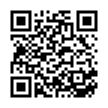

<!-- _class: lead -->
2025年後期

# 情報学実験B
## 実世界センシング＆ビジュアライゼーション
## Chapter 4

フィジカルコンピューティングチーム
担当教員：菊池、遠藤

---
# 目次

1. [M5データ収集デバイスの制作](#M5データ収集デバイスの制作)

---
## 実験スケジュール
- 1週目：導入＆実験準備
    - 実験概要説明＆環境構築
    - M5のサンプルコード動作確認
    - センサーのサンプルコードテスト
- 2週目：データ保存＆ビジュアライゼーション手法
    - SDへのデータ保存＆センサデータのSD保存
    - ビジュアライゼーション手法＆サンプル

- 3週目：ビジュアライゼーションのアイディア出し
    - アイディア出し
    - アイディアチェック＆修正

---
- 4週目：センシングデバイスのプロトタイプ実装
    - M5センサの実装＆データ保存の確認
    - 可視化プロトタイプ実装＆ダミーデータテスト
- 5週目：実世界フィールドワーク 
    - 学内でデータ収集実験
    - データの確認＆追加実験
- 6週目：ビジュアライゼーション制作
    - ビジュアライゼーション制作1
    - ビジュアライゼーション制作2

- 休み期間：(学祭 or 冬休み)

- 7週目：予備日(追実験＆レポート作成)
    - レポート作成

---
## 実験を行う前の注意点
- 実験機材は最新の注意を払って扱うこと
- 電子機器、回路を扱うので、水分が付いた手で扱わないこと(感電します)
- PCの上でマイコン、電子機器を扱わないこと(ショートします)

 

- ChatGPTや生成AIの使用について
    - コードの実装には使っていい
    - レポートには使っちゃダメ
    - 生成AIはコードが脱線するから1から作り直しになることもある
    - 生成AIより教員とSA/TAを頼って
    - [生成AIとの付き合い方 / Generative AI and us](https://speakerdeck.com/kaityo256/generative-ai-and-us)

---
## レポートについて
- 各回の実験内容をレポートにまとめる
- 実験環境や実験機材など細かく記載する
- 実験の様子など正確に撮影し、レポートに図として取り入れる
- 制作したビジュアライゼーション作品についてレポートでまとめる
(コンセプト、実装方法、実験環境、ビジュアライズの方法など)

 

- レポート作成時に、実験内容を思い出せるように、ノートを用意し各回メモを取ること。

---
## 本日の課題

本日の実験内容を実験ノートにまとめ、最終レポートに備え、小レポートを作成する。

小レポート内容：下記項目について写真や図などを入れ、まとめる

- データを収集するM5のプログラムについて
  - 仕様するセンサ
  - データの取得方法(離散的or連続的？、条件は？)
  - 保存するデータ(センサ値？、時刻？)
- 可視化の方法、表現方法について
  - 2Dor3D?
  - 地図上？ヒストグラム？レーダーチャート？
  - アニメーション有無？
 
小レポートの提出はしなくて良いが、最終レポートに備え作成することを推奨する。

---
<!-- _class: lead -->
### 実世界センシング＆ビジュアライゼーション
# M5データ収集デバイスの制作

---
前回の可視化アイディアを元にM5でデータを収集するデバイスを作成する。

## どんなデータを記録するか

- センサ値：温度、明るさ、距離、加速度など
- 時刻情報：millis() または RTC（日時）で測定タイミングを記録
- 識別情報：装置ID、場所、実験条件 などを併記すると整理しやすい

## いつ・どのくらいの頻度で記録するか

離散的(Discreate)：ボタン操作や条件が成立したときに1回記録
→ 例：人が通過したとき、ボタンを押したとき

連続的(Continuous)：一定間隔ごとに自動記録
→ 例：1秒ごとに温度を記録、100msごとに加速度を記録

記録間隔は目的に応じて調整（例：delay()やタイマー割り込みで制御）

※[RTCを使った時刻カウント＋保存](https://github.com/kikpond15/is-lab-b/tree/main/projects/12_save_rtc)があるので、参考にしてみてください。

---

## 保存時の注意点

SDカードを正しく初期化する（SD.begin()）
- ファイルは「追記モード」で開く (FILE_WRITE)
- 実験条件や日付でファイル名を区別（例：/temp_20251016.csv）

- SDカード内のCSVをPCで開き、データが取れているか、時間のズレや欠損がないか、異常値（例：0や999など）がないかをチェック
 

**コードを作成できたら、実行してみよう！
データがちゃんと保存されているか確認してみよう！**

--- 
## GPS保存アプリ

遠藤先生がGPSを連続で記録するWebアプリケーションを作ってくださいました。

[アプリケーションの使い方はこちら](https://github.com/enkatsu/location-recorder/blob/main/README.ja.md)

https://enkatsu.github.io/location-recorder/

 

---
<!-- _class: lead -->
### 実世界センシング＆ビジュアライゼーション
# ビジュアライゼーション作品の制作

---

## 可視化の方法、表現方法について

データを「どう見せるか」を考える
取得したデータはそのままだと「数値の羅列」

ビジュアライゼーションは
👉 データの特徴や傾向を視覚的に伝える方法

どんな情報を「伝えたいか」を意識して可視化方法を選ぶ

---
## アニメーション・インタラクションを取り入れる

データの時間変化を動きで見せる
→ Processing の draw() を活用

センサ値に応じて色や大きさを変化させる
→ 例：明るさが上がると円が大きくなる

[時刻カウントデータの可視化サンプル](https://github.com/kikpond15/is-lab-b/tree/main/projects/08_visualize_samples/mulchCsvViz)